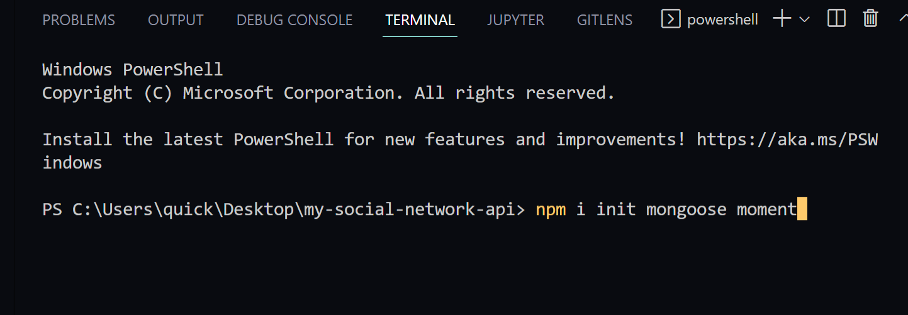
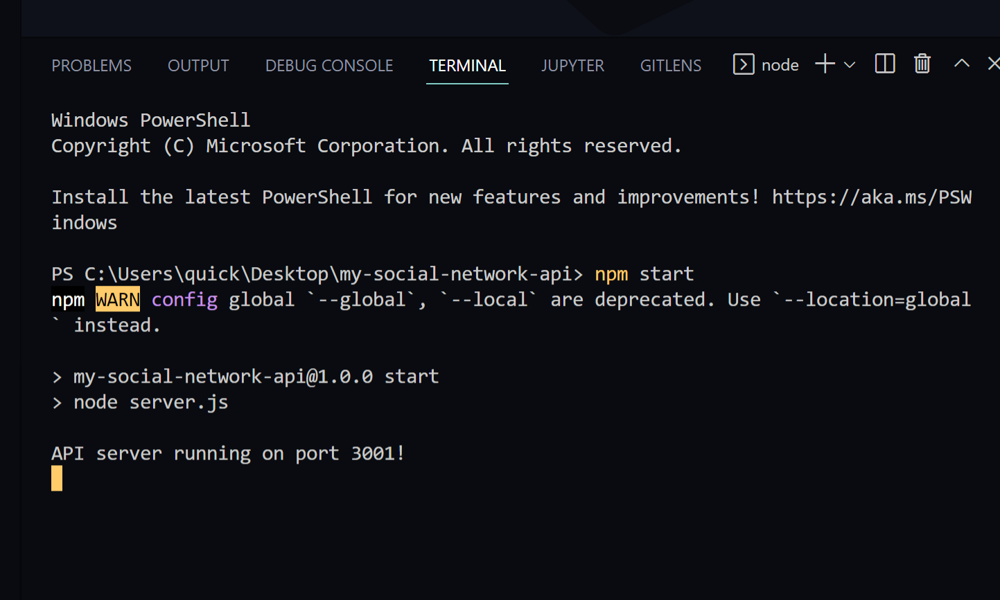

# My-Social-Network-API

## Table of Contents

- [Description](#Description)
- [Walkthrough-Video](#Walkthrough-Video)
- [Installation](#installation)
- [Usage](#usage)
- [Instructions](#instructions)
- [Created by](#Created-by)
- [Questions](#questions)

## Description

This is a social networking API web app to give a place for users to add their thoughts, make friends, and react to friends thoughts. This app utilizes mongoose, moment.js and operates through insomnia. Below is a walk through video.

## Walkthrough-Video
https://user-images.githubusercontent.com/102430476/185806300-3ed16603-74ec-451f-8ba0-12cec03dd8cd.mp4

## Youtube-channel
 - [Youtube-Channel](https://youtu.be/CMWN3QPdcjs)

## Installation

In order to install this project you must clone this project on to your local machine.

## Usage

Use this project to build a social networking hub for poeple to access and share thoughts with eachother..

## Instructions

- Step 1: Clone this repository

* 

- Step 2: Install dependencies with 'npm install'

* 

- Step 3: start server

* 

- Step 4: You can create, read, update, and delete users and thoughts, and add and delete reactions and friends using these urls:
    - http://localhost:3001/api/user
    - http://localhost:3001/api/user/:id (required to delete, update, or just to read one category)
    
    - To post a user - JSON being sent will be this: { "username": "username", "email": "email@example.com" }
    - http://localhost:3001/api/user/:userId/friends/:friendsId (required to delete and add a friend)

    - http://localhost:3001/api/thoughts
      To create a thought - JSON being send will be formated like this: { "thoughtText": "This is an example thought", "username":          "username of person creating the thought" }
    - http://localhost:3001/api/thoughts/:id (required to delete, update, or just to read one tag)
    - http://localhost:3001/api/thougts/:thoughtsId/reactions (required to add a reaction to a thought)

      To create a reaction - JSON being send will be formated like this: { "reactionBody": "This is an example reaction",                 "username": "username of person creating the reaction" }
    - http://localhost:3001/api/thoughts/:thoughtsId/reactions/:reactionsId (required to delete a reaction from a thought)

## Created-by

[Jeremy](https://github.com/quicksilver524) - 

## Questions

- If you have any further questions please feel free to contact us at [quicksilver524@gmail.com](quicksilver524@gmail.com)
